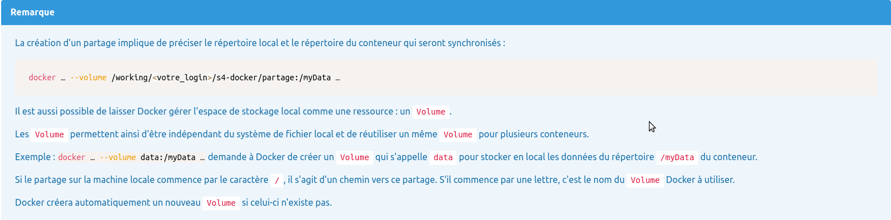

# Initiation à docker
## Auteur
```Axel COUDROT```
## A chaque début de séance :
```bash
cd /working/coud0011/
rm s4-docker
mkdir s4-doker; cd s4-docker
git clone https://iut-info.univ-reims.fr/gitlab/coud0011/s4-docker.git
docker login
```
Si nécessaire :
```bash
/home/Users/coud0011/bin/docker-clean --all
```

## TP2
### Commandes à savoir
- Pour lancer un containeur
```
docker run <nom du containeur>
```
- Pour lister les images présentes sur la machine
```
docker images
```
- Pour lister les container présents sur la machine
```
docker container ps -a
```
- Pour supprimer un container/une image
```
docker <container/image> rm <nom du container/image>
```
- De la même manière pour lister les container/une image
```
docker <container/image> ls (-a pour les container actif et inactifs)
```
- Pour télécharger la derniere version d'une image docker
```
docker pull <nom de l'image>
```
- Pour arrêter un container il y a deux manières : exit dans le mode interactif ou alors depuis un autre terminal : 
```
docker stop <nom du server>
```
- Pour lancer une commande dans un container sans passer par son pseudo terminal : 
```
docker exec <nom du conteneur> <commande linux>
```
- Pour relancer un container arrêté :
```
docker start <nom du serveur>
```
- Pour reconnecter les entrées / sorties du terminal avec un container lancé:
```
docker attach <nom du container lancé>
```
### Autres informations
- Lors d'un docker run sur un container inexistant, docker va télécharger l'image sur le hub docker, créer un container avec celle-ci et l'exécuter.
- Pour lancer un serveur en l'empechant de s'arrêter juste après, il faut rajouter -ti pour -t qui ouvre un pseudo-terminal et -i qui permet de rediriger l'entrée standard du container


## TP3
### Commandes à savoir
- Pour accéder au logs d'un container (si besoin il est possible de le faire dynamiquement avec --follow avant le nom du container)
```
docker logs <--follow ><nom du container>
```
- Pour avoir l'usage des ressources de CPU, mémoire et réseau
```
docker stats <nom du container>
```
- Pour récupérer l'ensemble des informations liées à un conteneur 
```
docker inspect <nom du container>
```
- Pour créer un container sans le démarrer
```
docker container create <nom de l'image>
```
- Pour supprimer tous les conteneur inactifs
```
docker container prune
```

## TP4

- Utilisation de :
```
docker run -ti --name=my-ubuntu --volume /working/<votre_login>/s4-docker/partage:/myData ubuntu /bin/bash
```
- A la racine du container, les fichier ne persistent pas en dehors de celui-ci, ils ne sont présent que à l'intérieur. Pour accéder à des fichier dans la machine hôte il faut utiliser le dossier spécifié lors de la création, dans notre exemple : /myData
