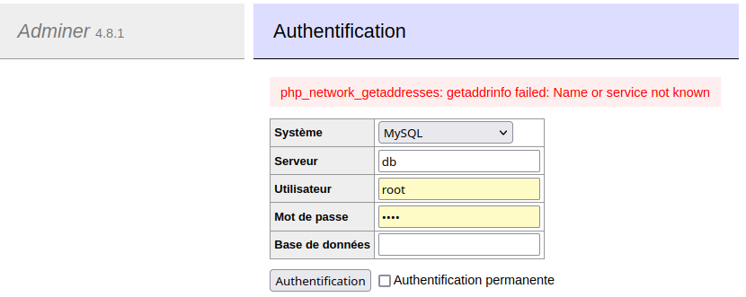

# Initiation à docker
## Auteur
```Axel COUDROT```


## Table des matière
- [Début des séances](#a-chaque-début-de-séance)
- [Informations importantes](#informations-importantes)
- [TP2](#tp2)
- [TP3](#tp3)
- [TP4](#tp4)
- [TP5](#tp5)
- [TP6](#tp6)
- [TP7](#tp7)
- [TP8](#tp8)
- [TP9](#tp9)
- [TP10](#tp10)
- [TP11](#tp11)
- [TP12](#tp12)
- [TP13](#tp13)
## A chaque début de séance :
```bash
cd /working/coud0011/
rm s4-docker
mkdir s4-doker; cd s4-docker
git clone https://iut-info.univ-reims.fr/gitlab/coud0011/s4-docker.git
docker login
```
Si nécessaire :
```bash
/home/Users/coud0011/bin/docker-clean --all
```

## Informations importantes

- Lorsque vous voudrez vous connectez au serveur bd maria db (lorsque ce sera fait notamment à partir de [docker-compose](#tp5)), vous devrez vous connecter avec :

| Système | MySQL |
| :--------------- |:---------------:| 
| Serveur | my-mariadb |
| Utilisateur | root |
| Mot de passe | root |
| Base de données | vide |


## TP2
 *Retour à la [table des matière](#table-des-matière)*
### Commandes à savoir
- Pour lancer un containeur
```bash
docker run <nom du containeur>
```
- Pour lister les images présentes sur la machine
```bash
docker images
```
- Pour lister les container présents sur la machine
```bash
docker container ps -a
```
- Pour supprimer un container/une image
```bash
docker <container/image> rm <nom du container/image>
```
- De la même manière pour lister les container/une image
```bash
docker <container/image> ls (-a pour les container actif et inactifs)
```
- Pour télécharger la derniere version d'une image docker
```bash
docker pull <nom de l'image>
```
- Pour arrêter un container il y a deux manières : exit dans le mode interactif ou alors depuis un autre terminal : 
```bash
docker stop <nom du server>
```
- Pour lancer une commande dans un container sans passer par son pseudo terminal : 
```bash
docker exec <nom du conteneur> <commande linux>
```
- Pour relancer un container arrêté :
```bash
docker start <nom du serveur>
```
- Pour reconnecter les entrées / sorties du terminal avec un container lancé:
```bash
docker attach <nom du container lancé>
```
### Autres informations
- Lors d'un docker run sur un container inexistant, docker va télécharger l'image sur le hub docker, créer un container avec celle-ci et l'exécuter.
- Pour lancer un serveur en l'empechant de s'arrêter juste après, il faut rajouter -ti pour -t qui ouvre un pseudo-terminal et -i qui permet de rediriger l'entrée standard du container


## TP3
 *Retour à la [table des matière](#table-des-matière)*
### Commandes à savoir
- Pour accéder au logs d'un container (si besoin il est possible de le faire dynamiquement avec --follow avant le nom du container)
```bash
docker logs <--follow ><nom du container>
```
- Pour avoir l'usage des ressources de CPU, mémoire et réseau
```bash
docker stats <nom du container>
```
- Pour récupérer l'ensemble des informations liées à un conteneur 
```bash
docker inspect <nom du container>
```
- Pour créer un container sans le démarrer
```bash
docker container create <nom de l'image>
```
- Pour supprimer tous les conteneur inactifs
```bash
docker container prune
```

## TP4
 *Retour à la [table des matière](#table-des-matière)*

- Utilisation de :
```bash
docker run -ti --name=my-ubuntu --volume /working/<votre_login>/s4-docker/partage:/myData ubuntu /bin/bash
```
- A la racine du container, les fichier ne persistent pas en dehors de celui-ci, ils ne sont présent que à l'intérieur. Pour accéder à des fichier dans la machine hôte il faut utiliser le dossier spécifié lors de la création, dans notre exemple : /myData


## TP5
 *Retour à la [table des matière](#table-des-matière)*
### Commandes à savoir
- Pour créer notre propre pont réseau ici nommé db-network
```bash
docker network create db-network
```
- Pour lister l'ensemble des réseaux
```bash
docker network ls
```
- Pour inspecter le réseau créé
```bash
docker network inspect db-network
```
- Pour ajouter ce network lors de la création de container : ajouter --network db-network dans les oprions, par exemple (avec en plus une bd mariadb et un mot de passe root en variable d'environnement):
```bash
 docker run --name my-mariadb --detach --env MYSQL_ROOT_PASSWORD=root --network db-network mariadb
 ```
 - Pour créer un container *adminer* permetant d'avoir une interface web : 
 ```bash
 docker run --network db-network --detach --publish 7080:8080 adminer
 ```
 - Si l'on n'utilisait pas --network, nous aurions un erreur comme celle ci-dessous lors de la connexion à la bd dans l'interface web. En effet, le pont entre les deux (l'interface et la bd n'auraient pas été mis en place) :
 

 - Par défault, lors de la création du container, le volume et le network peuvent avoir du mal à coexister à cause d'un problème de droit (sous windows, il n'y a pas ce problème)


 ## TP6
 *Retour à la [table des matière](#table-des-matière)*
 ### Nouvelle(s) Méchanique(s)
 - Nous utiliserons désormais un fichier de configuration YAML nommé docker-compose pour stocker les information nécéssaires pour lancer un ensemble de conteneurs qui seront sur un même réseau créé automatiquement. Il sera possible de lancer la création à l'aide de la [première commande](#commandes-c3a0-savoir-3).
 ### Commandes à savoir
 - Commande pour lancez la pile de conteneur en mode détachée
 ```bash
 docker-compose up -d
 ```
 - Commande pour se connecter au serveur de bd avec un terminal de commande
 ```bash
 docker-compose exec my-mariadb bash
 ```
 *Cette commande est équivalente à la commande docker :*

    exec -it my-mariadb bash

- Vous pourrez dès lors listez les bases de données présentes sur ce serveur en tapant la commande suivante dans le terminal précédement ouvert
```bash
mariadb-show -p
```
*Le mot de passe demandé est [celui de l'adminstrateur de la BD](#informations-importantes).*


## TP7
 *Retour à la [table des matière](#table-des-matière)*
 ### Nouvelle(s) Méchanique(s)
- Utilisation d'un Dockerfile pour configurer la construction d'une image. Dans notre cas, nous en créons [une](apache/Dockerfile) qui permettra de lancer les serveur web Apache.
 ### Commandes à savoir
- Pour créer l'image à partir du Dockerfile : 
```bash
docker build --tag=<votre_login>/apache ./apache
```
- Ce qui permet ensuite de démarrer un container basé sur cette image sans monter de volume (Utilisation de la variable d'environnement **$USER** définie par défaut dans linux et il faut mettre **%USERNAME%** sous windows)
```bash
docker run --detach --publish 8080:80 --name=hello-docker $USER/hello-docker
```
Désormais le serveur web est bien accessible à l'adresse http://localhost:8080.
Il est alors possible de [déposer l'image <votre_login>/hello_docker](https://docs.docker.com/guides/walkthroughs/publish-your-image/) sur le [Hub Docker](https://hub.docker.com/).

## TP8
 *Retour à la [table des matière](#table-des-matière)*

 ### Nouvelle(s) Méchanique(s)

Mise en place d'une vraie application avec le projet symfony-contacts développé en S3. Il s'agit d'une application web de gestion de contacts avec comptes, modifications des contacts et easy admin en utilisant symfony. Vous pourrez trouver le zip docker-assets.zip à la [racine du projet](.). 

Une fois unzip dans le dossier de l'application, son contenu (un dossier [docker](symfony-contacts/docker) contenant les assets nécessaires ainsi que le fichier [.dockerignore](symfony-contacts/.dockerignore) définissant les fichiers et répertoires à exclure du contexte de traitement de Docker) sera associé avec un [Dockerfile](symfony-contacts/Dockerfile) afin de créer un container pour mettre en place l'application.

Si vous regardez le [Dockerfile](symfony-contacts/Dockerfile), vous remarquerez que l'image importée est [php:8.1-fpm-alpine](https://hub.docker.com/_/php). [8.1](https://www.php.net/releases/8.1/en.php) étant la version de php, [-fpm](https://fpm.readthedocs.io/en/v1.15.1/) pour le developpement, et [-alpine](https://www.alpinelinux.org/) pour récupérer la version la plus brut de linux. Et que cette image est renommée contacts_php.

A la ligne 67 de [Dockerfile](symfony-contacts/Dockerfile) vous trouverez une nouvelle phase, celle-ci sous nginx afin de mettre en place la possibilité d'utiliser du javascript, du css ou des images.

 ### Commandes à savoir

 - Dans notre exemple pour créer l'image à partir du [Dockerfile](symfony-contacts/Dockerfile) il suffit de lancer la commande suivante :
 ```bash
 docker build --tag $USER/symfony-contacts --target contacts_php .
 ```
 *Comme avant, il faut remplacer $USER par %USERNAME% sous windows*

 - Pour la deuxième phase, afin de créer l'image liée à nginx nommée dans notre cas <votre_login>/symfony-contacts-nginx, il faut executer cette commande : 
 ```bash
 docker build --tag $USER/symfony-contacts-nginx --target contacts_nginx .
 ```
  *Comme avant, il faut remplacer $USER par %USERNAME% sous windows*


## TP9
 *Retour à la [table des matière](#table-des-matière)*
 ### Nouvelle(s) Méchanique(s)
 Nous abordons maintenant la configuration du [Docker Compose](symfony-contacts/docker-compose.yml) de développement.
 Celui-ci contient les informations pour les services suivants :
 - **Base de Données** : nommée db il s'agit d'une [image de MariaDB](https://hub.docker.com/_/mariadb) dont la configuration de l'adresse se fait dans le [.env.local](symfony-contacts/.env.local). Dans l'adresse entrée, vous pouvez retrouver des variables d'environnement définies dans le [Docker Compose](symfony-contacts/docker-compose.yml), celles-ci peuvent être modifier afin qu'elles correspondent à vos informations personnelles.
- **PHP** : il s'agit du service pouvant faire le lien entre la base de donnée et notre phase contacts_php. Dans le container associé, nous avons créé un volume permettant de lier la [racine du projet](.) au répertoire /srv/contacts ainsi que celui permettant de surcharger le fichier config.ini de votre image avec le fichier [dev.ini](docker/php/conf.d/dev.ini) présent dans le [zip précédent](#tp8).
Ce fichier de configuration spécifique pour le développement permet de réactiver le [rechargement du cache](https://www.php.net/manual/fr/opcache.configuration.php#ini.opcache.validate-timestamps) à chaque modification d'un fichier du projet. Nous avons récupérer le répertoire au sein du container pour config.ini à l'aide de la [commande ci-dessous](#commandes-c3a0-savoir-6).

- **Mise en place des droits** : Par la suite nous allons donc pouvoir lancer l'application. Mais juste avant, il faut être sûr que tous les droits sont bien mis en place, dans notre contexte de travail, nous avons besoin d'un certain nombre de droits pour que tout fonctionne bien, ce n'est pas forcément nécessaire pour toutes les machines. Ces droits si vous voulez les explorer, sont accessible dans le fichier [droits.sh](symfony-contacts/droits.sh).

- **Lancement de l'application** : Nous allons enfin pouvoir lancer notre application, celle-ci se lancer avec la commande : 
```bash
docker-compose up
```
Attention cependant, il vous faudra avoir, pour notre projet, composer sur votre machine, ainsi que symfony. Du coup, vous devrez vérifier que le [composer.lock](symfony-contacts/composer.lock) est à jour :
```bash
composer update
```
De plus, vous pouvez vérifier que tous les package fonctionnent correctement, même s'ils vont être réinstallés par la suite dans le conteneur :
```bash
composer install
```

Une fois ceci fait, vous remarquerez que lors du lancement, si vous n'avez pas d'autres erreurs pouvant être dues à votre config, vous aurez un problème de base de donnée. C'est normal, il faudra que vous executiez la commande suivant, pendant que le conteneur docker est lancé :
```bash
docker-compose exec php composer db
```
Et si tout se passe bien, à ce moment là, l'application sera accessible à l'adresse : [http://127.0.0.1:8080](http://127.0.0.1:8080).

Par la suite, nous avons ajouté phpMyAdmin pour avoir une interface de gestion de base de donnée pour vérifier que les opérations se passent bien.
Celle-ci est accessible sur le port [8085](http://127.0.0.1:8085)

Pour vous connecter une fois sur la page de phpMyAdmin, vous aurez à laisser le champ "Serveur" vide, et à remplir les autres avec les informations situées dans le fichier [docker-compose.yml](symfony-contacts/docker-compose.yml), actuellement celles-ci sont :
- Identifiant : coud0011
- Mot de Passe : 1Mot2Pass

 ### Commandes à savoir
- Voici la commande permettant d'obtenir un container similaire à celui de la phase contacts_php afin de comprendre notamment la structure du container :
```bash
docker run -it php:8.1-fpm-alpine /bin/sh
```
- Commande pour lancer l'application :
```bash
docker-compose up
```
- Commander pour mettre en place la bd de l'application (à executer durant l'éxecution de la commande précédente)
```bash
docker-compose exec php composer db
```


## TP10
 *Retour à la [table des matière](#table-des-matière)*
 ### Nouvelle(s) Méchanique(s)
#### Cette partie est consacrée à la mise en production de notre projet.
Nous avons donc ajouté deux nouvelles phases à la suite de notre [Dockerfile](symfony-contacts/Dockerfile). Une phase pour php en production (contacts_php_prod) et une phase pour nginx en production (contacts_nginx_prod). Pour tester la validité de ces deux phases nous avons utilisées les deux commandes [ci-après](#commandes-c3a0-savoir-7).

 ### Commandes à savoir
 - Pour tester la mise en production (php)
 ```bash
docker build --tag $USER/symfony-contacts --target contacts_php_prod .
 ```
  - Pour tester la mise en production (nginx)
 ```bash
docker build --tag $USER/symfony-contacts --target contacts_php_prod .
 ```


## TP11
 *Retour à la [table des matière](#table-des-matière)*
 ### Nouvelle(s) Méchanique(s)

 ### Commandes à savoir


## TP12
 *Retour à la [table des matière](#table-des-matière)*
 ### Nouvelle(s) Méchanique(s)

 ### Commandes à savoir


## TP13
 *Retour à la [table des matière](#table-des-matière)*
 ### Nouvelle(s) Méchanique(s)

 ### Commandes à savoir

